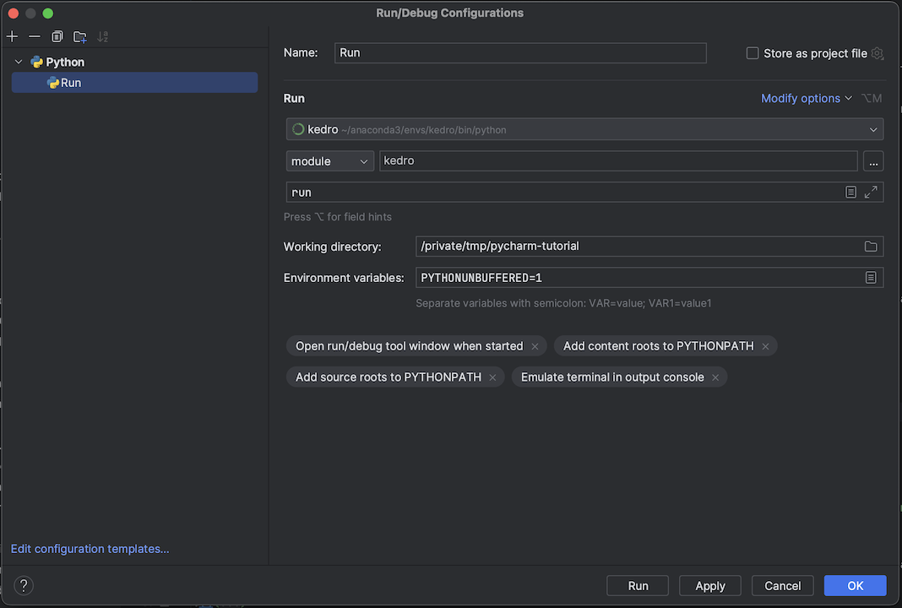
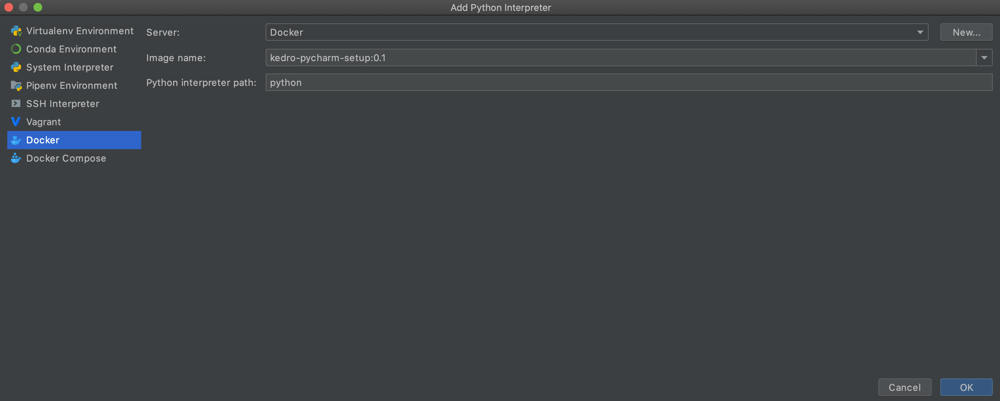
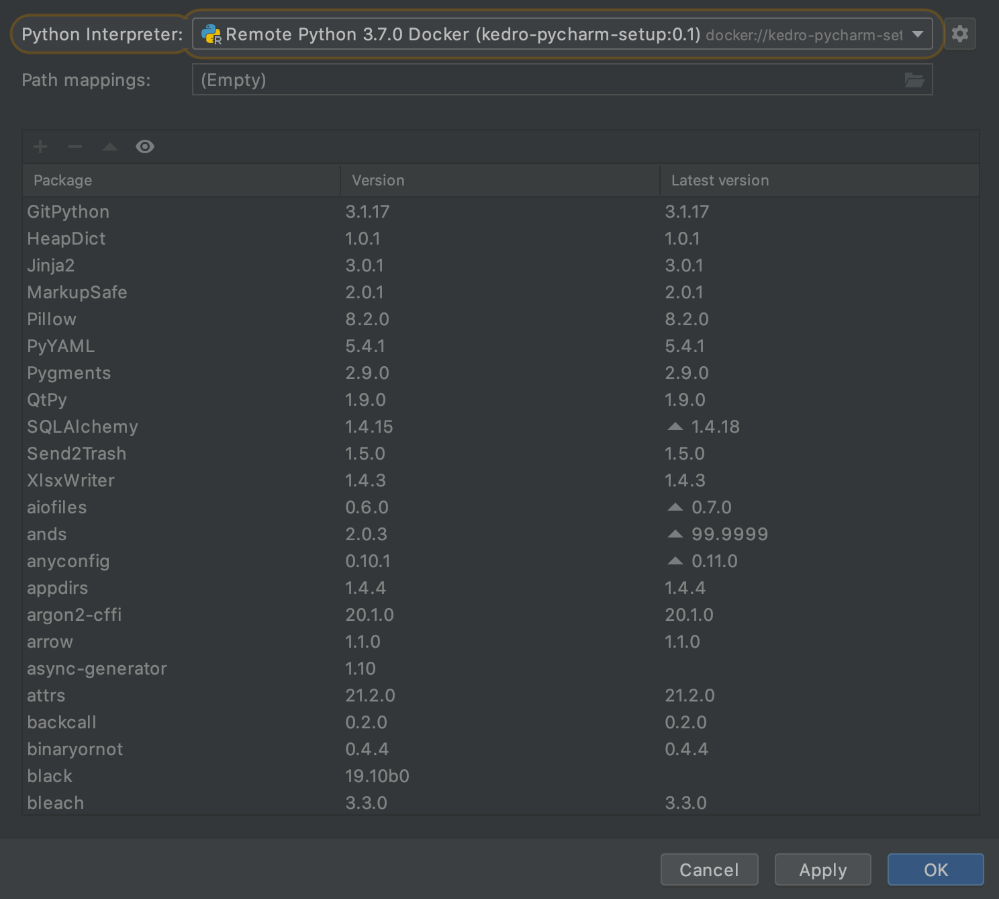
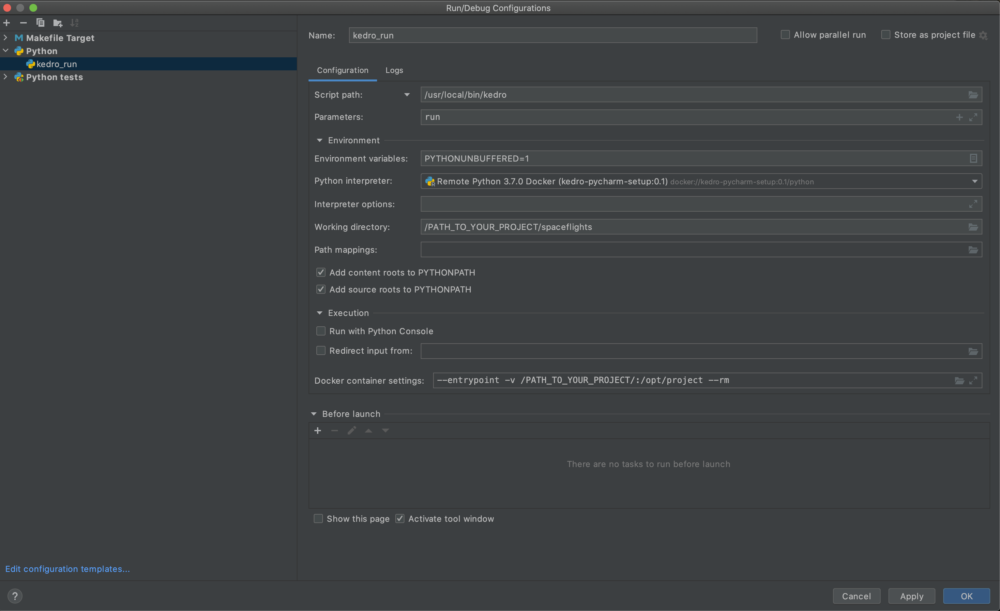

# Set up PyCharm

This section will present a quick guide on how to configure [PyCharm](https://www.jetbrains.com/pycharm/) as a development environment for working on Kedro projects.

Open a new project directory in PyCharm. You will need to add your **Project Interpreter**, so go to **PyCharm | Preferences** for macOS or **File | Settings** for Windows and Linux:


Choose **Project Interpreter**: <br />


Click the cog on the right-hand side and click **Add**:


Select **Conda Environment**:


Choose **Existing environment** and navigate your way to find your existing environment. If you don't see your `conda` environment in the dropdown menu then you need to open a `terminal` / `command prompt` with your `conda` environment activated and run:

```console
# macOS / Linux
which python
# Windows
python -c "import sys; print(sys.executable)"
```

Paste the interpreter path into the file picker and click **OK**: <br />


Finally, in the **Project Explorer** right-click on `src` and then go to **Mark Directory as | Sources Root**:


## Set up Run configurations

[PyCharm Run configurations](https://www.jetbrains.com/help/pycharm/creating-and-editing-run-debug-configurations.html) allow you to execute preconfigured scripts rapidly in your IDE with a click of a button. This may be useful for testing, running and packaging your Kedro projects.

Here we will walk you through an example of how to setup Run configuration for Kedro CLI `run` command, however it is also applicable to other Kedro commands: `test`, `install`, `package`, `build-docs`.

Go to **Run | Edit Configurations**:


Add a new **Python** Run configuration:


Create a **Run / Debug Configuration** for `kedro run` and get the path to the Kedro CLI script:

```console
# macOS / Linux
which kedro

# Windows (in `cmd`)
python -c "import sys, os.path; print(os.path.join(os.path.dirname(sys.executable), 'Lib\site-packages\kedro\__main__.py'))"
```

Edit the new Run configuration as follows:



Replace **Script path** with path obtained above and **Working directory** with the path of your project directory and then click **OK**.

To execute the Run configuration, select it from the **Run / Debug Configurations** dropdown in the toolbar (if that toolbar is not visible, you can enable it by going to **View > Toolbar**). Click the green triangle:


You may also select **Run** from the toolbar and execute from there. <br />


For other `kedro` commands, follow same steps but replace `run` in the `Parameters` field with the other commands that are to be used (e.g., `test`, `package`, `build-docs` etc.).


## Debugging

To debug, simply click the line number in the source where you want execution to break:


Then click the bug button in the toolbar () and execution should stop at the breakpoint:


>For more information about debugging with PyCharm take a look at the [debugging guide on jetbrains.com](https://www.jetbrains.com/help/pycharm/part-1-debugging-python-code.html).


## Advanced: Remote SSH interpreter

```eval_rst
.. note::  This section uses features supported in PyCharm Professional Edition only.
```

Firstly, add an SSH interpreter. Go to **Preferences | Project Interpreter** as above and proceed to add a new interpreter. Select **SSH Interpreter** and fill in details of the remote computer:


Click **Next** and add the SSH password or SSH private key:


Click **Next** and add the path of the remote interpreter. Assuming a Unix-like OS, this can be found by running `which python` within the appropriate `conda` environment on the remote computer.


Click **Finish**. Go to **Run / Debug Configurations** to add a **Remote Run**. Select the remote interpreter that you have just created. For the script path, get the path of the Kedro CLI on the remote computer by running `which kedro` (macOS / Linux) in the appropriate environment.


Click **OK** and then select **Remote Run** from the toolbar and click **Run** to execute remotely.


To remotely debug, click the debugger button as [described above](#debugging).


## Advanced: Docker interpreter

```eval_rst
.. note::  This section uses features supported by PyCharm Professional Edition only.
```

First, add a Docker interpreter. Go to **Preferences | Project Interpreter** as above and proceed to add a new interpreter. Select **Docker Interpreter** and then choose the target Docker image:



Click **OK** and check that the required packages appear:



Click **OK** and wait for PyCharm to index your new Python interpreter.

Click **OK**. Go to **Run / Debug Configurations** to add a **Python Run**. For the script path, get the path to the Kedro CLI on an instantiated image by running `which kedro` (macOS / Linux) in a container environment. Specify `run` as the parameter. Specify your working directory as the directory that contains your Kedro project on your local machine. Optional: Edit the Docker container volume mount setting if it does not match the directory that contains your Kedro project directory.



Click **OK** and then select your run configuration from the toolbar and click **Run** to execute.

[To debug, click the debugger button as described above](#debugging).

## Configure Python Console

You can configure Pycharm's IPython to load Kedro's Extension.

Click **PyCharm | Preferences** for macOS or **File | Settings**, inside **Build, Execution, Deployment** and **Console**, enter the **Python Console** configuration.

You can append the configuration necessary to use Kedro IPython to the **Starting script** as described in the [IPython configuring documentation](https://kedro.readthedocs.io/en/latest/11_tools_integration/02_ipython.html).


With this configuration, when you create a Python Console you should be able to use context, session and catalog.


## Configuring the Kedro catalog validation schema

You can enable the Kedro catalog validation schema in your PyCharm IDE to enable real-time validation, autocompletion and see information about the different fields in your `catalog` as you write it. To enable this, open a `catalog.yml` file and you should see "No JSON Schema" in the bottom right corner of your window. Click it and select "Edit Schema Mapping".


Add a new mapping using the "+" button in the top left of the window and select the name you want for it. Enter this URL `https://raw.githubusercontent.com/kedro-org/kedro/develop/static/jsonschema/kedro-catalog-0.17.json` in the "Schema URL" field and select "JSON Schema Version 7" in the "Schema version" field.

Add the following file path pattern to the mapping: `conf/**/*catalog*`.


> Different schemas for different Kedro versions can be found [here](https://github.com/kedro-org/kedro/tree/main/static/jsonschema).
