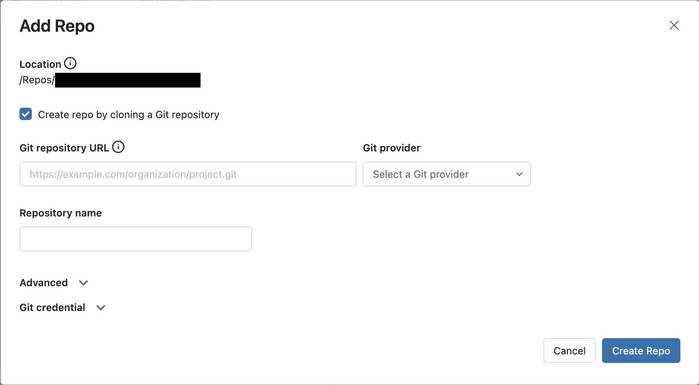
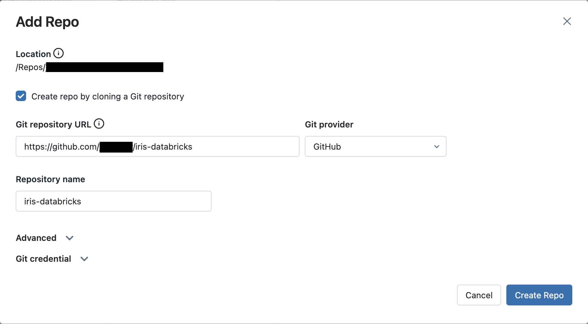
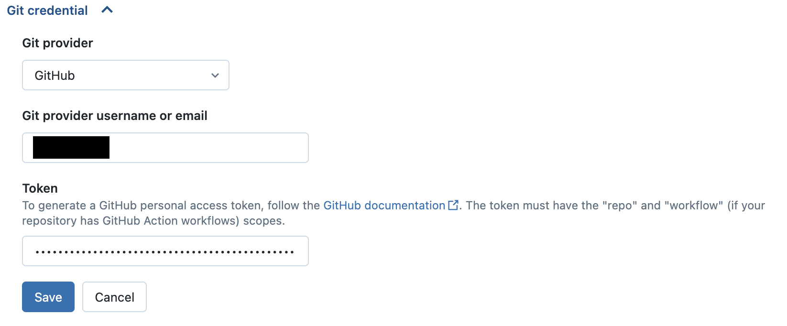
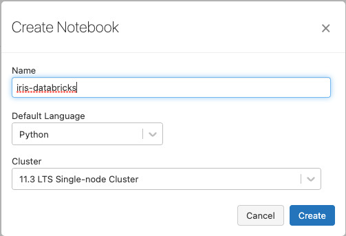
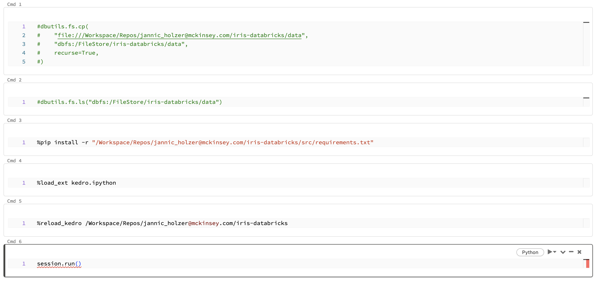
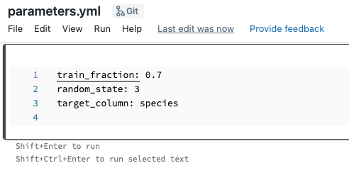

# Use a Databricks workspace to develop a Kedro project

This guide demonstrates a workflow for developing Kedro projects on Databricks using only a Databricks Repo and a Databricks notebook. You will learn how to develop and test your Kedro projects entirely within the Databricks workspace.

This method of developing a Kedro project for use on Databricks is ideal for developers who prefer developing their projects in notebooks rather than an in an IDE. It also avoids the overhead of setting up and syncing a local environment with Databricks. If you want to take advantage of the powerful features of an IDE to develop your project, consider following the [guide for developing a Kedro project for Databricks using your local environment](./databricks_ide_development_workflow.md).

In this guide, you will store your project's code in a repository on [GitHub](https://github.com/). Databricks integrates with many [Git providers](https://docs.databricks.com/repos/index.html#supported-git-providers), including GitLab and Azure DevOps. The steps  to create a Git repository and sync it with Databricks also generally apply to these Git providers, though the exact details may vary.

## What this page covers

This tutorial introduces a Kedro project development workflow using only the Databricks workspace. The main steps in this workflow are:

- [Create a new Kedro project using the `databricks-iris` starter.](#create-a-new-kedro-project)
- [Create a Databricks notebook to run your project.](#create-a-new-databricks-notebook)
- [Copy project data to DBFS.](#copy-project-data-to-dbfs-using-dbutils)
- [Modify your project in the Databricks workspace](#modify-your-project-and-test-the-changes)

## Prerequisites

- An active [Databricks deployment](https://docs.databricks.com/getting-started/index.html).
- A [Databricks cluster](https://docs.databricks.com/clusters/configure.html) configured with a recent version (>= 14.0 is recommended) of the Databricks runtime.
- Python >= 3.10 installed.
- Git installed.
- A [GitHub](https://github.com/) account.
- A Python environment management system installed, [venv](https://docs.python.org/3/library/venv.html), [virtualenv](https://virtualenv.pypa.io/en/latest/) or [Conda](https://docs.conda.io/en/latest/) are popular choices.

## Set up your project

### Install Kedro in a new virtual environment

In your local development environment, create a virtual environment for this tutorial. Any environment management system can be used, though the following commands use Conda:

```bash
conda create --name iris-databricks python=3.10
```

Once it is created, activate it:

```bash
conda activate iris-databricks
```

With your Conda environment activated, install Kedro:

```bash
pip install kedro
```

### Create a new Kedro project

Create a Kedro project with the `databricks-iris` starter using the following command in your local environment:

```bash
kedro new --starter=databricks-iris
```

Name your new project `iris-databricks` for consistency with the rest of this guide. This command creates a new Kedro project using the `databricks-iris` starter template.

 ```{note}
 If you are not using the `databricks-iris` starter to create a Kedro project, **and** you are working with a version of Kedro **earlier than 0.19.0**, then you should [disable file-based logging](https://docs.kedro.org/en/0.18.14/logging/logging.html#disable-file-based-logging) to prevent Kedro from attempting to write to the read-only file system.
 ```

### Create a GitHub repository

Now you should [create a new repository in GitHub](https://docs.github.com/en/github/getting-started-with-github/create-a-repo) using the official guide. Keep the repository private and don't commit to it yet. For consistency with the rest of this guide, name your GitHub repository `iris-databricks`.

### Create a GitHub personal access token

To synchronise your project between your local development environment and Databricks, you will use a private GitHub repository, which you will create in the next step. For authentication, you will need to create a GitHub personal access token. [Create this token in your GitHub developer settings](https://docs.github.com/en/authentication/keeping-your-account-and-data-secure/managing-your-personal-access-tokens#creating-a-fine-grained-personal-access-token).

The main steps are:

- Verify your email and navigate to "Settings" under your profile photo.
- Select "Developer settings" then "Fine-grained tokens" and click on "Generate new token".
- Select a name and expiration time for your token, choose an expiration time.
- Select which repositories your token will allow access to and define the token permissions.

### Push your Kedro project to the GitHub repository

At the command line, initialise Git in your project root directory:

```bash
# change the directory to the project root
cd iris-databricks/
# initialise git
git init
```

Then, create the first commit:

```bash
# add all files to git staging area
git add .
# create the first commit
git commit -m "first commit"
```

To connect to your GitHub repository from your local environment, use one of two options:

- **SSH:** If you choose to connect with SSH, you will also need to configure [the SSH connection to GitHub](https://docs.github.com/en/github/authenticating-to-github/connecting-to-github-with-ssh), unless you already have [an existing SSH key configured for GitHub](https://docs.github.com/en/github/authenticating-to-github/checking-for-existing-ssh-keys)
- **HTTPS:** If using HTTPS, you will be asked for your GitHub username and password when you push your first commit. Use your GitHub username and your [personal access token](#create-a-github-personal-access-token) generated in the previous step as the password, [do _not_ use your original GitHub password](https://docs.github.com/en/rest/overview/authenticating-to-the-rest-api#authenticating-with-username-and-password).

With one of these two options chosen, run the following commands:

```bash
# configure a new remote
# for HTTPS run:
git remote add origin https://github.com/<username>/iris-databricks.git
# or for SSH run:
git remote add origin git@github.com:<username>/iris-databricks.git

# verify the new remote URL
git remote -v

# push the first commit
git push --set-upstream origin main
```

### Create a repo on Databricks

You will now create a repo on Databricks using the following steps:

1. **Create a new repo:**

- Navigate to the `Repos` tab in the Databricks workspace UI and click `Add Repo`.
- Keep the `Add Repo` popup open for the following steps.



2. **Specify your GitHub repo:**

- In the `Git repository URL` field, enter your GitHub repository's URL. This will automatically populate the `Git provider` and `Repository name` fields also.



3. **Authenticate Databricks with GitHub:**

- Click on the `Git credential` field.
- In the `Git provider` field, select `GitHub` in the dropdown menu.
- In the `Git provider username or email` field, enter the username or email address of your GitHub account.
- In the `Token` field, enter your [GitHub personal access token](#create-a-github-personal-access-token).
- Click the `Save` button to save your new Git credential.



4. **Finish the Repo creation process:**

- Click `Create Repo`. Your GitHub repository is cloned to Databricks and the popup window closes.

### Create a new Databricks notebook

Now that your project is available in a Databricks Repo, you can run it on a cluster using a notebook.

To run the Python code from your Databricks repo, [create a new Python notebook](https://docs.databricks.com/notebooks/notebooks-manage.html#create-a-notebook) in your workspace. Name it `iris-databricks` for traceability and attach it to your cluster:



### Copy project data to DBFS using dbutils

On Databricks, Kedro cannot access data stored directly in your project's directory. As a result, you'll need to move your project's data to a location accessible by Databricks. You can store your project's data in the Databricks File System (DBFS), where it is accessible.

A number of methods exist for moving data to DBFS. However, in this guide, you will use your new notebook and `dbutils`.

To move your locally stored data to DBFS, open your `iris-databricks` notebook and in the first cell enter the following python code:

```python
dbutils.fs.cp(
    "file:///Workspace/Repos/<databricks_username>/iris-databricks/data/",
    "dbfs:/FileStore/iris-databricks/data",
    recurse=True,
)
```

Run this cell to copy the complete directory and its contents from your Repo to DBFS.

To ensure that your data was copied correctly, you can list the contents of the destination directory in DBFS. Create a new cell underneath the first cell and enter the following code:

```python
dbutils.fs.ls("dbfs:/FileStore/iris-databricks/data")
```

Run this command to displays the contents of your project's `data/` directory. You can expect to see the following structure:

```bash
[FileInfo(path='dbfs:/FileStore/iris-databricks/data/01_raw', name='01_raw', size=...),
 FileInfo(path='dbfs:/FileStore/iris-databricks/data/02_intermediate', name='02_intermediate', size=...),
 FileInfo(path='dbfs:/FileStore/iris-databricks/data/03_primary', name='03_primary', size=...),
 FileInfo(path='dbfs:/FileStore/iris-databricks/data/04_feature', name='04_feature', size=...),
 FileInfo(path='dbfs:/FileStore/iris-databricks/data/05_model_input', name='05_model_input', size=...),
 FileInfo(path='dbfs:/FileStore/iris-databricks/data/06_models', name='06_models', size=...),
 FileInfo(path='dbfs:/FileStore/iris-databricks/data/07_model_output', name='07_model_output', size=...),
 FileInfo(path='dbfs:/FileStore/iris-databricks/data/08_reporting', name='08_reporting', size=...)]
```

After these cells have successfully run, you should comment the code inside them so their operations are not unnecessarily performed during notebook runs. The cells should appear as below:

**Cell 1:**

```ipython
#dbutils.fs.cp(
#    "file:///Workspace/Repos/<databricks_username>/iris-databricks/data",
#    "dbfs:/FileStore/iris-databricks/data",
#    recurse=True,
#)
```

**Cell 2:**

```ipython
#dbutils.fs.ls("dbfs:/FileStore/iris-databricks/data")
```

### Run your project

Create **four new cells** inside your notebook. You will fill these cells with code that runs your project. When copying the following code snippets, remember to replace `<databricks_username>` with your username on Databricks such that `project_root` correctly points to your project's location.

1. Before you import and run your Python code, you'll need to install your project's dependencies on the cluster attached to your notebook. Your project has a `requirements.txt` file for this purpose. Add the following code to the first new cell to install the dependencies:

```ipython
%pip install -r "/Workspace/Repos/<databricks_username>/iris-databricks/requirements.txt"
```

2. To run your project in your notebook, you must load the Kedro IPython extension. Add the following code to the second new cell to load the IPython extension:

```ipython
%load_ext kedro.ipython
```

3. Loading the extension allows you to use the `%reload_kedro` line magic to load your Kedro project. Add the following code to the third new cell to load your Kedro project:

```ipython
%reload_kedro /Workspace/Repos/<databricks_username>/iris-databricks
```

4. Loading your Kedro project with the `%reload_kedro` line magic will define four global variables in your notebook: `context`, `session`, `catalog` and `pipelines`. You will use the `session` variable to run your project. Add the following code to the fourth new cell to run your Kedro project:

```ipython
session.run()
```

After completing these steps, your notebook should match the following image:



Run the completed notebook using the `Run All` button in the top right of the UI:


On the first run of your Kedro project, you will be prompted to consent to analytics, type `y` or `N` in the field that appears and press `Enter`:


You should see logging output while the cell is running. After execution finishes, you should see output similar to the following:

```bash
...
2023-06-06 12:55:22,705 - iris_databricks.nodes - INFO - Model has an accuracy of 0.953 on test data.
2023-06-06 12:55:22,709 - kedro.runner.sequential_runner - INFO - Completed 3 out of 3 tasks
2023-06-06 12:55:22,709 - kedro.runner.sequential_runner - INFO - Pipeline execution completed successfully.
```

## Modify your project and test the changes

Now that your project has run successfully once, you can make changes using the Databricks UI. In this section, you will modify the project to use a different ratio of training data to test data and check the effect of this change.

### Modify the training / test split ratio

The `databricks-iris` starter uses a default 80-20 ratio of training data to test data when training the classifier. You will edit this ratio to 70-30 and re-run your project to view the different result.

In the Databricks workspace, click on the `Repos` tab in the side bar and navigate to `<databricks_username>/iris-databricks/conf/base/`. Open the file `parameters.yml` by double-clicking it. This will take you to a built-in file editor. Edit the line `train_fraction: 0.8` to `train_fraction: 0.7`, your changes will automatically be saved.



### Re-run your project

Return to your Databricks notebook. Re-run the third and fourth cells in your notebook (containing the code `%reload_kedro ...` and `session.run()`). The project will now run again, producing output similar to the following:

```bash
...
2023-06-06 12:56:14,399 - iris_databricks.nodes - INFO - Model has an accuracy of 0.972 on test data.
2023-06-06 12:56:14,403 - kedro.runner.sequential_runner - INFO - Completed 3 out of 3 tasks
2023-06-06 12:56:14,404 - kedro.runner.sequential_runner - INFO - Pipeline execution completed successfully.
```

You can see that your model's accuracy has changed now that you are using a different classifier to produce the result.

```{note}
If your cluster terminates, you must re-run your entire notebook, as libraries installed using `%pip install ...` are ephemeral. If not, repeating this step is only necessary if your project's dependencies change.
```

### Managing your Databricks Repo

Your Databricks Repo now has untracked changes that are not synced with your GitHub repository. To track your changes and sync your Repo, you can use the corresponding [Git operations in Databricks Repos](https://docs.databricks.com/repos/git-operations-with-repos.html). A basic overview of the steps to achieve this is:

- Commit your changes in your Databricks Repo.
- Push the changes to the GitHub repository linked to your Databricks Repo.
- Check that the latest commits are visible in your GitHub repository.

## Summary

This guide demonstrated a development workflow on Databricks using only the Databricks workspace. This approach is ideal for users who prefer to develop using notebooks and avoids having to set up and sync a local environment with Databricks.
