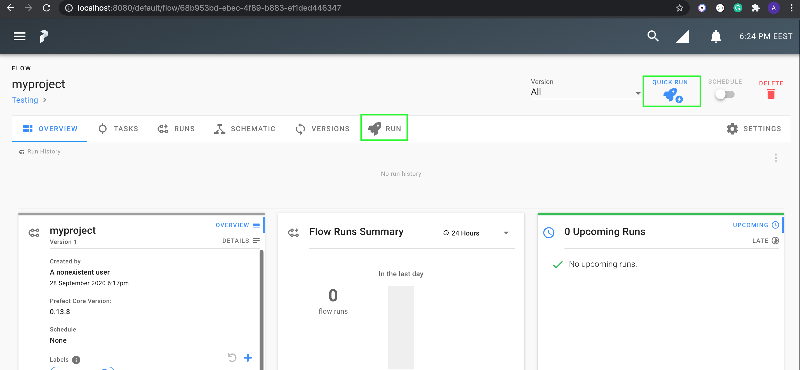

# Deployment with Prefect

This page explains how to run your Kedro pipeline using [Prefect Core](https://www.prefect.io/products/core/), an open-source workflow management system.

In scope of this deployment, we are interested in [Prefect Server](https://docs.prefect.io/orchestration/server/overview.html#what-is-prefect-server), an open-source backend that makes it easy to monitor and execute your Prefect flows and automatically extends the Prefect Core.

```{note}
Prefect Server ships out-of-the-box with a fully featured user interface.
```

## Prerequisites

To use Prefect Core and Prefect Server, ensure you have the following prerequisites in place:

- [Prefect Core is installed](https://docs.prefect.io/core/getting_started/install.html) on your machine
- [Docker](https://www.docker.com/) and [Docker Compose](https://docs.docker.com/compose/) are installed and Docker Engine is running
- [Prefect Server is up and running](https://docs.prefect.io/orchestration/Server/deploy-local.html)
- `PREFECT__LOGGING__EXTRA_LOGGERS` environment variable is set (this is required to get Kedro logs published):

```console
export PREFECT__LOGGING__EXTRA_LOGGERS="['kedro']"
```

## How to run your Kedro pipeline using Prefect

### Convert your Kedro pipeline to Prefect flow

To build a [Prefect flow](https://docs.prefect.io/core/concepts/flows.html) for your Kedro pipeline programmatically and register it with the Prefect API, use the following Python script, which should be stored in your project’s root directory:

```python
# <project_root>/register_prefect_flow.py
from pathlib import Path
from typing import Any, Dict, List, Tuple, Union

import click
from prefect import Client, Flow, Task
from prefect.exceptions import ClientError

from kedro.framework.hooks.manager import _create_hook_manager
from kedro.framework.project import pipelines
from kedro.framework.session import KedroSession
from kedro.framework.startup import bootstrap_project
from kedro.io import DataCatalog, MemoryDataSet
from kedro.pipeline.node import Node
from kedro.runner import run_node


@click.command()
@click.option("-p", "--pipeline", "pipeline_name", default=None)
@click.option("--env", "-e", type=str, default=None)
@click.option("--package_name", "package_name", default="kedro_prefect")
def prefect_deploy(pipeline_name, env, package_name):
    """Register a Kedro pipeline as a Prefect flow."""

    # Project path and metadata required for session initialization task.
    project_path = Path.cwd()
    metadata = bootstrap_project(project_path)

    pipeline_name = pipeline_name or "__default__"
    pipeline = pipelines.get(pipeline_name)

    tasks = {}
    for node, parent_nodes in pipeline.node_dependencies.items():
        # Use a function for task instantiation which avoids duplication of tasks
        _, tasks = instantiate_task(node, tasks)

        parent_tasks = []
        for parent in parent_nodes:
            parent_task, tasks = instantiate_task(parent, tasks)
            parent_tasks.append(parent_task)

        tasks[node._unique_key]["parent_tasks"] = parent_tasks

    # Below task is used to instantiate a kedro session within the scope of a
    # Prefect flow
    init_task = KedroInitTask(
        pipeline_name=pipeline_name,
        project_path=project_path,
        package_name=package_name,
        env=env,
    )

    with Flow(pipeline_name) as flow:
        generate_flow(init_task, tasks)
        instantiate_client(metadata.project_name)

    # Register the flow with the server
    flow.register(project_name=metadata.project_name)

    # Start a local agent that can communicate between the server
    # and your flow code
    flow.run_agent()


class KedroInitTask(Task):
    """Task to initialize kedro session"""

    def __init__(
        self,
        pipeline_name: str,
        package_name: str = None,
        project_path: Union[Path, str] = None,
        env: str = None,
        extra_params: Dict[str, Any] = None,
        *args,
        **kwargs,
    ):
        self.project_path = Path(project_path or Path.cwd()).resolve()
        self.extra_params = extra_params
        self.pipeline_name = pipeline_name
        self.env = env
        super().__init__(name=f"{package_name}_initialization", *args, **kwargs)

    def run(self) -> Tuple[DataCatalog, KedroSession]:
        """Initializes a Kedro session and returns the DataCatalog and KedroSession"""
        # bootstrap project within task / flow scope
        bootstrap_project(self.project_path)

        session = KedroSession.create(
            project_path=self.project_path, env=self.env, extra_params=self.extra_params
        )
        # Note that for logging inside a Prefect task self.logger is used.
        self.logger.info("Session created with ID %s", session.session_id)
        pipeline = pipelines.get(self.pipeline_name)
        context = session.load_context()
        catalog = context.catalog

        unregistered_ds = pipeline.data_sets() - set(catalog.list())  # type: ignore[union-attr]
        for ds_name in unregistered_ds:
            catalog.add(ds_name, MemoryDataSet())
        return catalog, session


class KedroTask(Task):
    """Kedro node as a Prefect task."""

    def __init__(self, node: Node):
        self._node = node
        super().__init__(name=node.name, tags=node.tags)

    def run(self, catalog, session):
        run_node(self._node, catalog, _create_hook_manager(), session.session_id)


def instantiate_task(
    node: Node,
    tasks: Dict[str, Dict[str, Union[KedroTask, List[KedroTask]]]],
) -> Tuple[KedroTask, Dict[str, Dict[str, Union[KedroTask, List[KedroTask]]]]]:
    """
    Function pulls node task from <tasks> dictionary. If node task not available
    in <tasks> the function instantiates the tasks and adds it to <tasks>. In this
    way we avoid duplicate instantiations of the same node task.

    Args:
        node: kedro node for which a prefect task is being created.
        tasks: dictionary mapping node names to a dictionary containing
        node tasks and parent node tasks.

    Returns: prefect task for the passed node and task dictionary.

    """
    if tasks.get(node._unique_key) is not None:
        node_task = tasks[node._unique_key]["task"]
    else:
        node_task = KedroTask(node)
        tasks[node._unique_key] = {"task": node_task}

    # return tasks as it is mutated. We want to make this obvious to the user.
    return node_task, tasks  # type: ignore[return-value]


def generate_flow(
    init_task: KedroInitTask,
    tasks: Dict[str, Dict[str, Union[KedroTask, List[KedroTask]]]],
):
    """
    Constructs a prefect flow given a task dictionary. Task dictionary
    maps kedro node names to a dictionary containing a node task and its
    parents.

    Args:
        init_task: Prefect initialisation tasks. Used to instantiate a kedro
        session within the scope of a prefect flow.
        tasks: dictionary mapping kedro node names to a dictionary
        containing a corresponding node task and its parents.

    Returns: None
    """
    catalog, session = init_task
    for task in tasks.values():
        node_task = task["task"]
        if len(task["parent_tasks"]) == 0:
            # When a task has no parent only the session init task should precede it.
            parent_tasks = [init_task]
        else:
            parent_tasks = task["parent_tasks"]
        # Set upstream tasks and bind required kwargs
        node_task.bind(upstream_tasks=parent_tasks, catalog=catalog, session=session)  # type: ignore[union-attr]


def instantiate_client(project_name: str):
    """Initiates prefect client"""
    client = Client()
    try:
        client.create_project(project_name=project_name)
    except ClientError:
        raise


if __name__ == "__main__":
    prefect_deploy()
```
```

```{note}
The script launches a [local agent](https://docs.prefect.io/orchestration/agents/local.html). Remember to stop the agent with Ctrl-C when you complete.
```


### Run Prefect flow

Now, having the flow registered, you can use [Prefect UI](https://docs.prefect.io/orchestration/ui/dashboard.html) to orchestrate and monitor it.

Navigate to http://localhost:8080/default?flows= to see your registered flow.


Click on the flow to open it and then trigger your flow using the "RUN"/"QUICK RUN" button.


