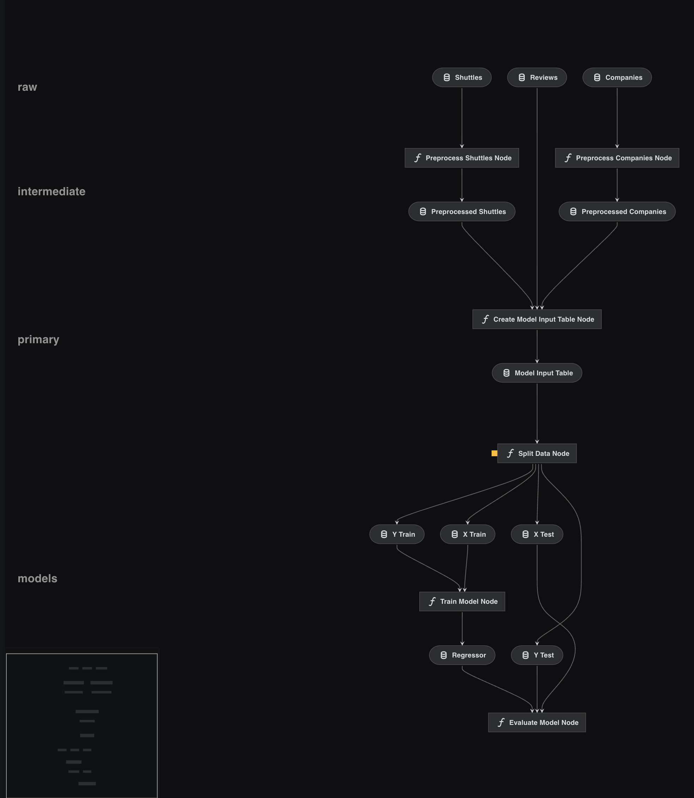
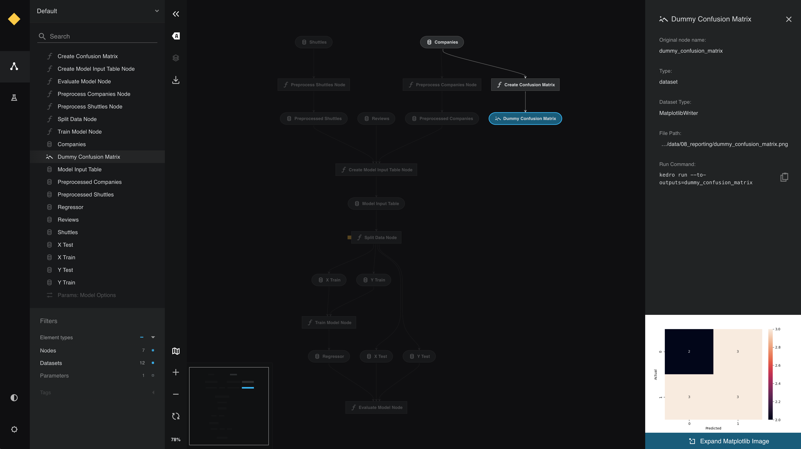
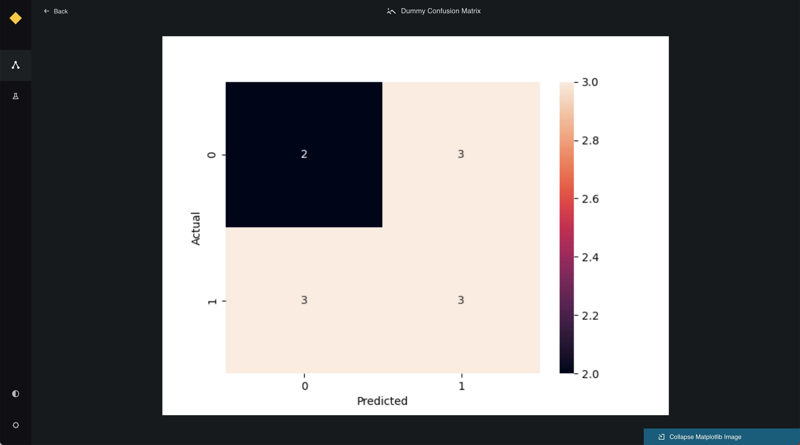

# Visualise pipelines

[Kedro-Viz](https://github.com/kedro-org/kedro-viz) displays data and machine-learning pipelines in an informative way, emphasising the connections between datasets and nodes. It shows the structure of your Kedro pipeline. This exercise assumes that you have been following the [Spaceflights tutorial](spaceflights_tutorial.md).

## Install Kedro-Viz

If you did not already install Kedro-Viz when you [installed the tutorial project dependencies](tutorial_template.md#install-dependencies), then you can do so now by running:
```bash
pip install kedro-viz
```

## Visualise a whole pipeline

You should be in your project root directory. Once Kedro-Viz is installed, to visualise your pipeline, run:
```bash
kedro viz
```

This command will run a server on http://127.0.0.1:4141 that will open up your visualisation on a browser. You should be able to see the following:


You can also use the `--autoreload` flag to autoreload Kedro Viz when a `Python` or `YAML` file has changed in the corresponding Kedro project.


If a visualisation panel opens up and a pipeline is not visible, then please check that your [pipeline definition](create_pipelines.md) is complete. All other errors can be logged as GitHub Issues on the [Kedro-Viz repository](https://github.com/kedro-org/kedro-viz).

## Exit an open visualisation

To exit this visualisation, close the open browser and enter **Ctrl+C** or **Cmd+C** in your terminal.

## Visualise layers

A pipeline can be broken up into different layers according to how data is processed, and using a convention for layers makes it easier to collaborate. For example, the [data engineering convention](../faq/faq.md#what-is-data-engineering-convention) shown here labels datasets according to the stage of the pipeline (e.g. whether the data has been cleaned).

Kedro-Viz makes it easy to visualise these data processing stages by adding a `layer` attribute to the datasets in the Data Catalog. We will be modifying the `catalog.yml` file with the following:

```yaml
companies:
  type: pandas.CSVDataSet
  filepath: data/01_raw/companies.csv
  layer: raw

reviews:
  type: pandas.CSVDataSet
  filepath: data/01_raw/reviews.csv
  layer: raw

shuttles:
  type: pandas.ExcelDataSet
  filepath: data/01_raw/shuttles.xlsx
  layer: raw

preprocessed_companies:
  type: pandas.CSVDataSet
  filepath: data/02_intermediate/preprocessed_companies.csv
  layer: intermediate

preprocessed_shuttles:
  type: pandas.CSVDataSet
  filepath: data/02_intermediate/preprocessed_shuttles.csv
  layer: intermediate

model_input_table:
  type: pandas.CSVDataSet
  filepath: data/03_primary/model_input_table.csv
  layer: primary

regressor:
  type: pickle.PickleDataSet
  filepath: data/06_models/regressor.pickle
  versioned: true
  layer: models
```

Run kedro-viz again with `kedro viz` and observe how your visualisation has changed to indicate the layers:



## Share a pipeline

Visualisations from Kedro-Viz are made shareable by using functionality that allows you to save the visualisation as a JSON file.

To save a visualisation, run:
```
kedro viz --save-file my_shareable_pipeline.json
```

This command will save a pipeline visualisation of your primary `__default__` pipeline as a JSON file called `my_shareable_pipeline.json`.

To visualise a saved pipeline, run:
```
kedro viz --load-file my_shareable_pipeline.json
```

This will visualise the pipeline visualisation saved as `my_shareable_pipeline.json`.


## Visualise charts in Kedro-Viz

Kedro-Viz aims to help users communicate different aspects of their workflow through an interactive flowchart. With the Plotly and Matplotlib integrations, we take one step further in this direction to allow our users to share their data insights effectively while exploring the pipeline.

### Visualise Plotly charts in Kedro-Viz

[Plotly](https://plotly.com/python/) is a free and open source Python library that allows you to make interactive, publication-quality graphs. With the Plotly integration on Kedro-Viz, you can output your interactive charts as part of your pipeline visualisation.

We have also used the Plotly integration to allow users to [visualise metrics from experiments](../logging/experiment_tracking.md).


You must update the `requirements.txt` file in your Kedro project and add the following datasets to enable Plotly for your project.

`kedro[plotly.PlotlyDataSet, plotly.JSONDataSet]==0.18.2`


You can view Plotly charts in Kedro-Viz when you use Kedro's plotly datasets.

There are two types of Plotly datasets in Kedro: the `plotly.PlotlyDataSet` and `plotly.JSONDataSet`.

#### [`plotly.PlotlyDataSet`](https://kedro.readthedocs.io/en/stable/kedro.extras.datasets.plotly.PlotlyDataSet.html#kedro.extras.datasets.plotly.PlotlyDataSet)

To use this dataset, configure your plot in the `catalog.yml` file. This dataset only supports [Plotly Express](https://plotly.com/python/plotly-express).

Below is an example of how to visualise plots on Kedro-Viz using `plotly.PlotlyDataSet`.

The below functions can be added to the `nodes.py` and `pipeline.py` files respectively.

```python
import pandas as pd


def compare_passenger_capacity(preprocessed_shuttles: pd.DataFrame):
    return preprocessed_shuttles.groupby(["shuttle_type"]).mean().reset_index()


def create_pipeline(**kwargs) -> Pipeline:
    """This is a simple pipeline which generates a plot"""
    return pipeline(
        [
            node(
                func=compare_passenger_capacity,
                inputs="preprocessed_shuttles",
                outputs="shuttle_passenger_capacity_plot",
            ),
        ]
    )
```

Next, configure the plot in the `catalog.yml` file:

```yaml
shuttle_passenger_capacity_plot:
  type: plotly.PlotlyDataSet
  filepath: data/08_reporting/shuttle_passenger_capacity_plot.json
  plotly_args:
    type: bar
    fig:
      x: shuttle_type
      y: passenger_capacity
      orientation: h
    layout:
      xaxis_title: Shuttles
      yaxis_title: Average passenger capacity
      title: Shuttle Passenger capacity
```


#### [`plotly.JSONDataSet`](https://kedro.readthedocs.io/en/stable/kedro.extras.datasets.plotly.JSONDataSet.html#kedro.extras.datasets.plotly.JSONDataSet)

To use this dataset, configure your plot in your Kedro node. This dataset supports [Plotly Express](https://plotly.com/python/plotly-express) and [Plotly Graph Objects](https://plotly.com/python/graph-objects/).


Below is an example of how to visualise plots using [Plotly Express](https://plotly.com/python/plotly-express) and [Plotly Graph Objects](https://plotly.com/python/graph-objects/) on Kedro-Viz using the `plotly.JSONDataSet`.

The below functions can be added to the `nodes.py` and `pipeline.py` files respectively.

```python
import plotly.express as px
import pandas as pd

# the below function uses plotly.express
def compare_passenger_capacity(preprocessed_shuttles: pd.DataFrame):
    fig = px.bar(
        data_frame=preprocessed_shuttles.groupby(["shuttle_type"]).mean().reset_index(),
        x="shuttle_type",
        y="passenger_capacity",
    )
    return fig


# the below function uses plotly.graph_objects
def compare_passenger_capacity(preprocessed_shuttles: pd.DataFrame):
    data_frame = preprocessed_shuttles.groupby(["shuttle_type"]).mean().reset_index()
    fig = go.Figure(
        [
            go.Bar(
                x=data_frame["shuttle_type"],
                y=data_frame["passenger_capacity"],
            )
        ]
    )
    return fig


def create_pipeline(**kwargs) -> Pipeline:
    """This is a simple pipeline which generates a plot"""
    return pipeline(
        [
            node(
                func=compare_passenger_capacity,
                inputs="preprocessed_shuttles",
                outputs="shuttle_passenger_capacity_plot",
            ),
        ]
    )
```

For `plotly.JSONDataSet`, you must also specify the output type in the `catalog.yml` file, like below.

```yaml
shuttle_passenger_capacity_plot:
  type: plotly.JSONDataSet
  filepath: data/08_reporting/shuttle_passenger_capacity_plot.json
```


Once the above setup is completed, you can do a `kedro run` followed by `kedro viz` and your Kedro-Viz pipeline will show a new dataset type with icon  . Click on the node to see a small preview of your Plotly chart in the metadata panel.


You can view the larger visualisation of the chart by clicking the 'Expand Plotly Visualisation' button on the bottom of the metadata panel.


### Visualise Matplotlib charts in Kedro-Viz

[Matplotlib](https://matplotlib.org/) is a Python library for creating static, animated, and interactive visualizations. Integrating Matplotlib into Kedro-Viz allows you to output your charts as part of your pipeline visualisation.

You can view Matplotlib charts in Kedro-Viz when you use the [Kedro MatplotLibWriter dataset](/kedro.extras.datasets.matplotlib.MatplotlibWriter). You must update the `src/requirements.txt` file in your Kedro project by adding the following dataset to enable Matplotlib for your project:

```
kedro[matplotlib.MatplotlibWriter]==0.18.2
```

```{note}
The MatplotlibWriter dataset converts Matplotlib objects to image files. This means that Matplotlib charts within Kedro-Viz are static and not interactive, unlike the Plotly charts seen above.
```

<!-- Add example on how to add Matplotlib charts-->

To use this dataset, configure your plot in your Kedro node.

Below is an example of how to visualise plots on Kedro-Viz using `matplotlib.MatplotlibWriter`.

The below functions can be added to the `nodes.py` and `pipeline.py` files respectively.

```python
# nodes.py
import matplotlib.pyplot as plt


def create_confusion_matrix(companies: pd.DataFrame):
    # generate random confusion matrix
    random_actuals = []
    random_predicted = []
    for i in range(0, 11):
        actual = random.randint(0, 1)
        predicted = random.randint(0, 1)
        random_actuals.append(actual)
        random_predicted.append(predicted)

    data = {"y_Actual": random_actuals, "y_Predicted": random_predicted}
    plt.style.use("dark_background")
    df = pd.DataFrame(data, columns=["y_Actual", "y_Predicted"])
    confusion_matrix = pd.crosstab(
        df["y_Actual"], df["y_Predicted"], rownames=["Actual"], colnames=["Predicted"]
    )
    sn.heatmap(confusion_matrix, annot=True)
    return plt


# pipeline.py
def create_pipeline(**kwargs) -> Pipeline:
    """This is a simple pipeline which generates a plot"""
    return pipeline(
        [
            node(
                func=create_confusion_matrix,
                inputs="companies",
                outputs="dummy_confusion_matrix",
            ),
        ]
    )
```

You must also specify the output type in the `catalog.yml` file, like below.

```yaml
reporting.dummy_confusion_matrix:
  type: matplotlib.MatplotlibWriter
  filepath: ${base_location}/08_reporting/dummy_confusion_matrix.png
  versioned: true
```


Once this setup is completed, you can do a `kedro run` followed by `kedro viz` and your Kedro-Viz pipeline will show a new dataset node with this icon . Click on the node to see a small preview of your Matplotlib image in the metadata panel.



You can view the larger visualisation of the chart by clicking the 'Expand Matplotlib Image' button on the bottom of the metadata panel.


