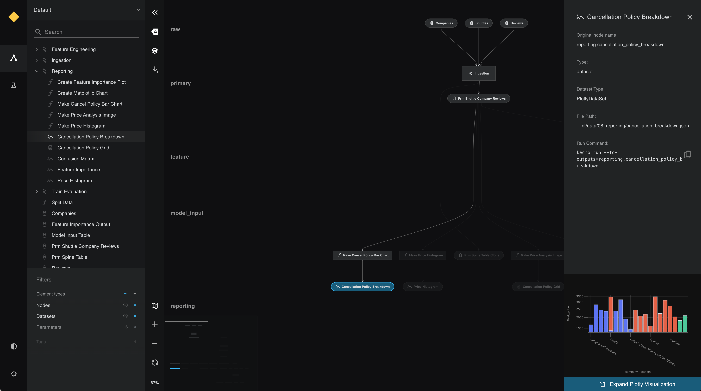
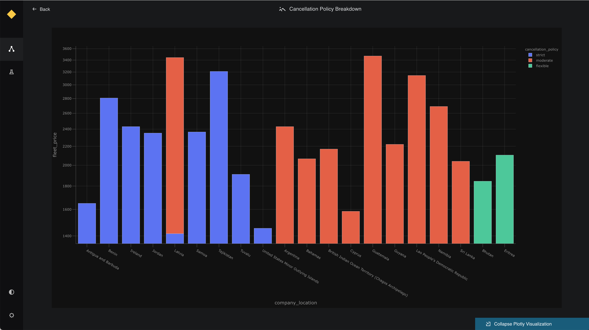

# Visualise charts in Kedro-Viz

## Visualisation with Plotly
Kedro-Viz supports [Plotly](https://plotly.com/python/) and [Matplotlib](https://matplotlib.org/) integrations so that you can share your data insights while exploring your pipeline.

[Plotly](https://plotly.com/python/) is a free and open source Python library that allows you to make interactive, publication-quality graphs. With the Plotly integration on Kedro-Viz, you can output your interactive charts as part of your pipeline visualisation.

We have also used the Plotly integration to allow users to [visualise metrics from experiments](../logging/experiment_tracking.md).


You must update the `requirements.txt` file in your Kedro project and add the following datasets to enable Plotly for your project.

`kedro-datasets[plotly.PlotlyDataSet, plotly.JSONDataSet]~=1.0.0`


You can view Plotly charts in Kedro-Viz when you use Kedro's plotly datasets.

There are two types of Plotly datasets in Kedro: the `plotly.PlotlyDataSet` and `plotly.JSONDataSet`.

### [`plotly.PlotlyDataSet`](https://kedro.readthedocs.io/en/stable/kedro.extras.datasets.plotly.PlotlyDataSet.html#kedro.extras.datasets.plotly.PlotlyDataSet)

To use this dataset, configure your plot in the `catalog.yml` file. This dataset only supports [Plotly Express](https://plotly.com/python/plotly-express).

Below is an example of how to visualise plots on Kedro-Viz using `plotly.PlotlyDataSet`.

The below functions can be added to the `nodes.py` and `pipeline.py` files respectively.

```python
# nodes.py
import pandas as pd


def compare_passenger_capacity(preprocessed_shuttles: pd.DataFrame):
    return preprocessed_shuttles.groupby(["shuttle_type"]).mean().reset_index()
```

```python
# pipeline.py
def create_pipeline(**kwargs) -> Pipeline:
    """This is a simple pipeline which generates a plot"""
    return pipeline(
        [
            node(
                func=compare_passenger_capacity,
                inputs="preprocessed_shuttles",
                outputs="shuttle_passenger_capacity_plot",
            ),
        ]
    )
```

Next, configure the plot in the `catalog.yml` file:

```yaml
shuttle_passenger_capacity_plot:
  type: plotly.PlotlyDataSet
  filepath: data/08_reporting/shuttle_passenger_capacity_plot.json
  plotly_args:
    type: bar
    fig:
      x: shuttle_type
      y: passenger_capacity
      orientation: h
    layout:
      xaxis_title: Shuttles
      yaxis_title: Average passenger capacity
      title: Shuttle Passenger capacity
```


### [`plotly.JSONDataSet`](https://kedro.readthedocs.io/en/stable/kedro.extras.datasets.plotly.JSONDataSet.html#kedro.extras.datasets.plotly.JSONDataSet)

To use this dataset, configure your plot in your Kedro node. This dataset supports [Plotly Express](https://plotly.com/python/plotly-express) and [Plotly Graph Objects](https://plotly.com/python/graph-objects/).


Below is an example of how to visualise plots using [Plotly Express](https://plotly.com/python/plotly-express) and [Plotly Graph Objects](https://plotly.com/python/graph-objects/) on Kedro-Viz using the `plotly.JSONDataSet`.

The below functions can be added to the `nodes.py` and `pipeline.py` files respectively.

```python
# nodes.py
import plotly.express as px
import plotly.graph_objs as go
import pandas as pd

# the below function uses plotly.express
def compare_passenger_capacity(preprocessed_shuttles: pd.DataFrame):
    fig = px.bar(
        data_frame=preprocessed_shuttles.groupby(["shuttle_type"]).mean().reset_index(),
        x="shuttle_type",
        y="passenger_capacity",
    )
    return fig


# the below function uses plotly.graph_objects
def compare_passenger_capacity(preprocessed_shuttles: pd.DataFrame):
    data_frame = preprocessed_shuttles.groupby(["shuttle_type"]).mean().reset_index()
    fig = go.Figure(
        [
            go.Bar(
                x=data_frame["shuttle_type"],
                y=data_frame["passenger_capacity"],
            )
        ]
    )
    return fig
```

```python
# pipeline.py
def create_pipeline(**kwargs) -> Pipeline:
    """This is a simple pipeline which generates a plot"""
    return pipeline(
        [
            node(
                func=compare_passenger_capacity,
                inputs="preprocessed_shuttles",
                outputs="shuttle_passenger_capacity_plot",
            ),
        ]
    )
```

For `plotly.JSONDataSet`, you must also specify the output type in the `catalog.yml` file, like below.

```yaml
shuttle_passenger_capacity_plot:
  type: plotly.JSONDataSet
  filepath: data/08_reporting/shuttle_passenger_capacity_plot.json
```


Once the above setup is completed, you can do a `kedro run` followed by `kedro viz` and your Kedro-Viz pipeline will show a new dataset type with icon  . Click on the node to see a small preview of your Plotly chart in the metadata panel.




You can view the larger visualisation of the chart by clicking the 'Expand Plotly Visualisation' button on the bottom of the metadata panel.





### Visualisation with Matplotlib

[Matplotlib](https://matplotlib.org/) is a Python library for creating static, animated, and interactive visualisations. Integrating Matplotlib into Kedro-Viz allows you to output your charts as part of your pipeline visualisation.

```{note}
The MatplotlibWriter dataset converts Matplotlib objects to image files. This means that Matplotlib charts within Kedro-Viz are static and not interactive, unlike the Plotly charts seen above.
```

You can view Matplotlib charts in Kedro-Viz when you use the [Kedro MatplotLibWriter dataset](/kedro.extras.datasets.matplotlib.MatplotlibWriter). You must update the `src/requirements.txt` file in your Kedro project by adding the following dataset to enable Matplotlib for your project:

```
kedro-datasets[matplotlib.MatplotlibWriter]~=1.0.0
```

To use this dataset, configure your plot in your Kedro node. The below functions should be added to the `nodes.py` and `pipeline.py` files respectively.

```python
# nodes.py
import matplotlib.pyplot as plt
import seaborn as sn


def create_confusion_matrix(companies: pd.DataFrame):
    actuals = [0, 1, 0, 0, 1, 1, 1, 0, 1, 0, 1]
    predicted = [1, 1, 0, 1, 0, 1, 0, 0, 0, 1, 1]
    data = {"y_Actual": actuals, "y_Predicted": predicted}
    df = pd.DataFrame(data, columns=["y_Actual", "y_Predicted"])
    confusion_matrix = pd.crosstab(
        df["y_Actual"], df["y_Predicted"], rownames=["Actual"], colnames=["Predicted"]
    )
    sn.heatmap(confusion_matrix, annot=True)
    return plt
```

> You might have to execute `pip install seaborn` if the [seaborn library](https://seaborn.pydata.org/) is not installed yet.

```python
# pipeline.py
def create_pipeline(**kwargs) -> Pipeline:
    """This is a simple pipeline which generates a plot"""
    return pipeline(
        [
            node(
                func=create_confusion_matrix,
                inputs="companies",
                outputs="dummy_confusion_matrix",
            ),
        ]
    )
```

You must also specify the output type in the `catalog.yml` file, like below. Remember to set the versioned flag to `true` if you want to add the plots to experiment tracking as well.

```yaml
dummy_confusion_matrix:
  type: matplotlib.MatplotlibWriter
  filepath: data/08_reporting/dummy_confusion_matrix.png
  versioned: true
```

Once this setup is completed, you can do a `kedro run` followed by `kedro viz` and your Kedro-Viz pipeline will show a new dataset node with this icon . Click on the node to see a small preview of your Matplotlib image in the metadata panel.


You can view the larger visualisation of the chart by clicking the 'Expand Matplotlib Image' button on the bottom of the metadata panel.


